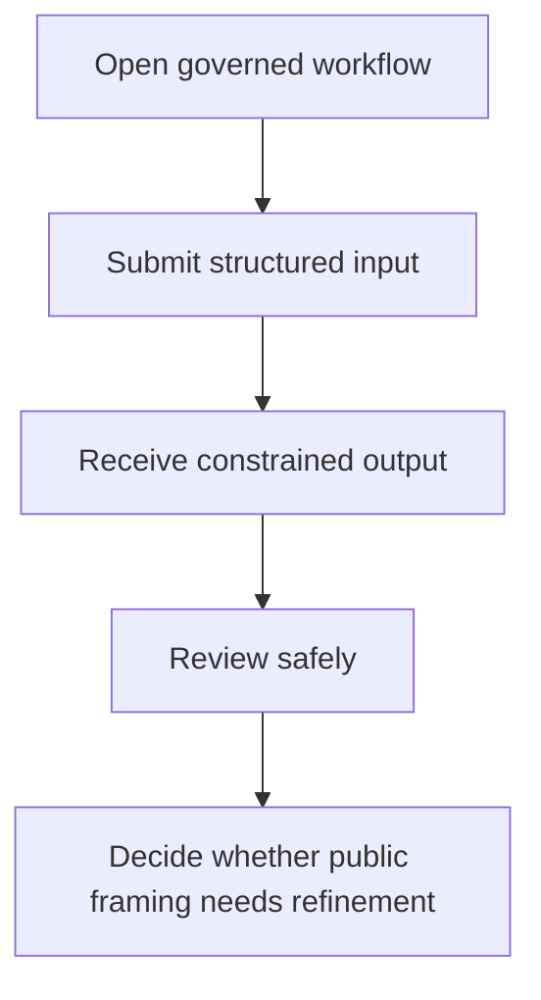

# Workflow

## High-level functional workflow
1. Open governed workflow
2. Submit structured input
3. Receive constrained output
4. Review safely
5. Decide whether public framing needs refinement

## Publication boundary
- The workflow is intentionally simplified.
- No internal rules, private thresholds, or sensitive processing detail are described here.
